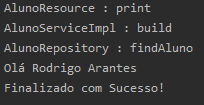

# java-training / mvc

### Exercicio MVC
**Criar uma arquitetura MVC, seguindo os padrões apresentados no treinamento. E de acordo com os seguintes requisitos abaixo:**

* Utilizar uma classe Main para iniciar o programa.
* Devemos respeitar as camadas. A classe Main deve apenas ter acesso ao Controller/Resource.
* Em cada camada deve ser impresso (sysout) o nome da classe quando o metodo for chamado.
* Repositorio devera fornecer o nome do aluno no metodo findAluno.
* Serviço deve montar e retornar a mensagem "Olá '_Nome do Aluno_"
* Controle deve imprimir (sysout) a mensagem completa.

#### A mensagem final deve ficar semelhante a apresentada abaixo:

